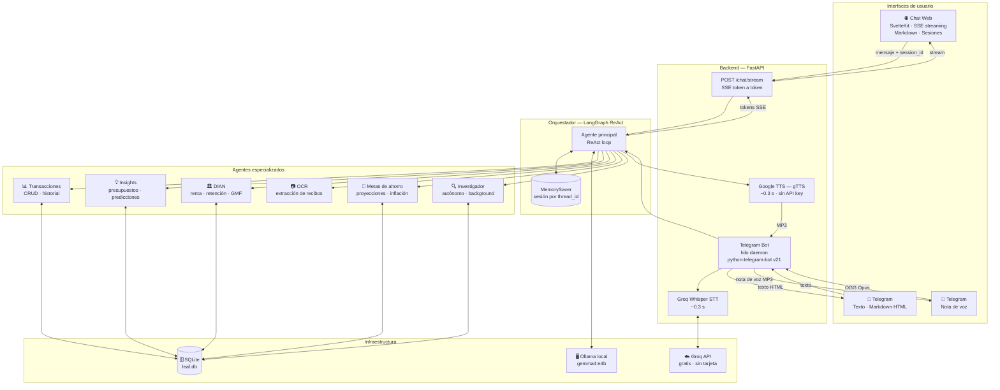
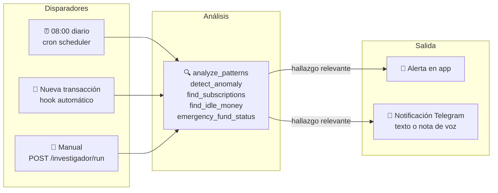
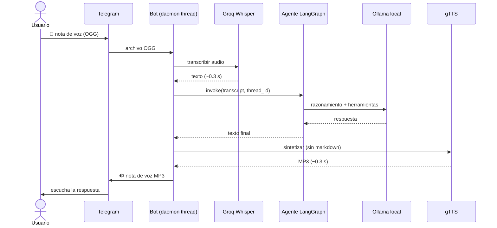

# Leaf 🌿

**Agente financiero personal colombiano — local-first, multi-agente, open source.**

Sin suscripciones. Tus datos en tu máquina.

## Inicio rápido

```bash
# 1. Clonar
git clone https://github.com/EstebanDevJR/Leaf.git
cd Leaf

# 2. Copiar variables de entorno
cp .env.example .env
# Edita .env: pon tu GROQ_API_KEY y opcionalmente el token de Telegram

# 3. Levantar todo con Docker Compose
docker compose up

# 4. Descargar el modelo LLM (primera vez)
docker compose exec ollama ollama pull gemma4:e4b
```

La app estará en http://localhost:5173 y la API en http://localhost:8000.

## Desarrollo local

### Backend

```bash
# Instalar uv
curl -LsSf https://astral.sh/uv/install.sh | sh

# Instalar dependencias
uv sync

# Correr backend
uv run uvicorn backend.main:app --reload --reload-dir backend
```

### Frontend

```bash
cd frontend
npm install
npm run dev
```

### Ollama (LLM local)

```bash
# Instalar Ollama: https://ollama.com
ollama pull gemma4:e4b
```

## Variables de entorno

```env
DATABASE_URL=sqlite:///./leaf.db
OLLAMA_BASE_URL=http://localhost:11434
OLLAMA_MODEL=gemma4:e4b
OLLAMA_VISION_MODEL=gemma4:e4b
DEBUG=false

# Voz / STT — Groq Whisper (gratis, sin tarjeta). TTS: Google TTS (gratis, sin key)
GROQ_API_KEY=

# Telegram (opcional)
TELEGRAM_BOT_TOKEN=      # obtenlo con @BotFather
TELEGRAM_CHAT_ID=        # tu chat ID personal
```

## Agentes

Leaf tiene seis agentes especializados orquestados por un ReAct central:

| Agente | Rol |
|--------|-----|
| **Orquestador** | Coordina todos los agentes, responde en chat con memoria de sesión |
| **Transacciones** | Registra, edita y consulta gastos e ingresos |
| **Insights** | Presupuestos, predicciones y resumen mensual |
| **DIAN** | Impuesto de renta, retención, GMF y fechas límite |
| **OCR** | Extrae datos de recibos con visión del modelo |
| **Investigador** | Monitoreo autónomo en background con toggle ON/OFF |

### Memoria de conversación

Cada sesión de chat mantiene contexto completo a través de `LangGraph MemorySaver`. El `session_id` se guarda en `localStorage` y se puede iniciar una nueva conversación con el botón **✦**.

El bot de Telegram usa el `chat_id` como identificador de sesión — cada usuario tiene su propia memoria.

### Agente Investigador

Corre en segundo plano y actúa sin que el usuario lo pida:

- **08:00 diario** — detecta dinero inactivo y anomalías de gasto.
- **Por cada transacción** — evalúa si el gasto es anómalo vs. el historial.
- **Manual** — `POST /investigador/run` para dispararlo en cualquier momento.

Herramientas disponibles también desde el chat:

```
analyze_patterns       tendencias de gasto vs. período anterior
detect_anomaly         alerta si el gasto supera 50% del promedio histórico
find_subscriptions     pagos recurrentes y suscripciones activas
calculate_savings_goal proyección de meta de ahorro con escenarios
get_cdt_rates          tasas CDT de referencia en bancos colombianos
analyze_weekday        distribución de gastos por día de semana
find_idle_money        balance acumulado sin movimiento reciente
emergency_fund_status  cobertura del fondo de emergencia en meses
generate_insight_report informe completo de todos los hallazgos
explain_concept        educación financiera (CDT, UVT, GMF, renta…)
```

Toggle ON/OFF:

```bash
curl -X POST http://localhost:8000/investigador/toggle \
  -H "Content-Type: application/json" -d '{"enabled": false}'

curl http://localhost:8000/investigador/status
```

## Telegram Bot

El bot de Telegram es la interfaz de voz y notificaciones de Leaf. Funciona con el mismo agente principal del chat web, compartiendo memoria y herramientas.

```env
TELEGRAM_BOT_TOKEN=123456:ABCdef...   # obtenlo con @BotFather
TELEGRAM_CHAT_ID=987654321            # tu chat ID personal
```

### Mensajes de texto

Escribe directamente al bot — el agente responde con markdown renderizado (negritas, listas, código).

### Mensajes de voz

Envía una nota de voz y Leaf responde también con audio:

```
Nota de voz OGG
  → Groq Whisper large-v3 (STT, ~0.3 s)
  → Agente principal (Ollama local)
  → Google TTS — gTTS (TTS, ~0.3 s)
  → Nota de voz MP3
```

El texto que se sintetiza pasa primero por un limpiador de markdown para que el TTS no lea asteriscos ni símbolos en voz alta.

### Comandos disponibles

| Comando | Descripción |
|---------|-------------|
| `/start` | Bienvenida y lista de comandos |
| `/gastos` | Resumen de gastos del mes actual |
| `/resumen` | Informe completo del Investigador (30 días) |
| `/metas` | Progreso de metas de ahorro activas |
| `/alertas` | Alertas DIAN/presupuesto activas |

### Notificaciones push del Investigador

Cuando el Investigador detecta anomalías relevantes, envía notificaciones proactivas al chat. Puede enviarlas como texto o como nota de voz usando `send_voice_notification()`.

## Voz

El procesamiento de voz usa servicios en la nube gratuitos — no se necesitan modelos locales.

| Componente | Servicio | Coste | Latencia |
|------------|----------|-------|----------|
| STT | Groq Whisper large-v3 | Gratis (7 200 req/día) | ~0.3 s |
| TTS | Google TTS (gTTS) | Gratis, sin API key | ~0.3 s/frase |

La voz está disponible **únicamente en el bot de Telegram** — no en el chat web.  
Para obtener tu API key de Groq (gratis, sin tarjeta): [console.groq.com](https://console.groq.com).

## Arquitectura

```
leaf/
├── backend/
│   ├── agents/           # Orquestador LangGraph (MemorySaver) + agentes especializados
│   ├── tools/            # 40+ herramientas tipadas
│   ├── api/routes/       # chat, transactions, budgets, alerts, investigador,
│   │                     # ocr, savings_goals, import_export, profiles,
│   │                     # dashboard, subscriptions, health
│   ├── services/
│   │   ├── groq_stt.py       # Groq Whisper STT
│   │   ├── voice_tts.py      # Google TTS (gTTS)
│   │   ├── stt_factory.py    # Factory STT
│   │   ├── telegram_bot.py   # Bot Telegram (hilo daemon, voz + markdown)
│   │   ├── alert_checker.py  # Verificador proactivo DIAN
│   │   ├── health_calculator.py
│   │   └── tax_calculator.py
│   ├── scheduler.py      # Job diario 08:00 + hook on_new_transaction
│   ├── db/               # SQLite engine + session
│   └── models/           # Transaction, Budget, Alert, InvestigadorConfig,
│                         # SavingsGoal, UserProfile
├── frontend/
│   └── src/lib/
│       ├── components/   # Chat (markdown con marked), TransactionDrawer,
│       │                 # SavingsGoals, CDTComparator, WhatIfSimulator,
│       │                 # HealthReport, SubscriptionsList, ConceptExplainer…
│       └── api.ts        # Cliente SSE + sesiones
└── docker-compose.yml
```

## Stack

| Capa | Tecnología |
|------|------------|
| Agentes | LangGraph + MemorySaver (memoria por sesión) |
| LLM | Ollama + gemma4 (local) |
| STT | Groq Whisper large-v3 (cloud, gratis) |
| TTS | Google TTS — gTTS (cloud, gratis, sin key) |
| API | FastAPI + Python 3.11 |
| ORM | SQLModel |
| DB | SQLite |
| Frontend | SvelteKit + Svelte 5 |
| Markdown | marked (renderizado en el chat) |
| Exportación | fpdf2 + openpyxl |
| Mensajería | python-telegram-bot v21 |
| HTTP client | httpx |
| Paquetes | uv |
| Infra | Docker Compose |

## API

```
POST   /chat/stream              chat con streaming SSE (token a token, session_id)
GET    /transactions/            historial de transacciones
GET    /transactions/stats       resumen mensual (ingresos, gastos, balance)
POST   /transactions/            crear transacción
PATCH  /transactions/{id}        editar transacción
DELETE /transactions/{id}        eliminar transacción
GET    /budgets/                 listar presupuestos
PUT    /budgets/{category}       crear/actualizar presupuesto
GET    /alerts/                  alertas activas
POST   /alerts/{id}/dismiss      descartar alerta
POST   /ocr/extract              extraer datos de recibo (imagen)
GET    /investigador/status      estado del toggle del Investigador
POST   /investigador/toggle      activar / desactivar Investigador
POST   /investigador/run         disparar análisis manual
GET    /savings-goals/           listar metas de ahorro
POST   /savings-goals/           crear meta de ahorro
PATCH  /savings-goals/{id}       actualizar meta (aportes, monto, etc.)
DELETE /savings-goals/{id}       eliminar meta
POST   /io/csv?bank=X            importar CSV bancario
POST   /io/dian-factura          importar factura electrónica XML
GET    /io/excel                 exportar mes a Excel
GET    /io/pdf?mode=standard     exportar mes a PDF
GET    /io/pdf?mode=contador     exportar en modo contador
GET    /profiles/                listar perfiles familiares
POST   /profiles/                crear perfil
DELETE /profiles/{id}            eliminar perfil
GET    /dashboard/cashflow       datos de flujo de caja para el dashboard
GET    /dashboard/emergency-fund estado del fondo de emergencia
GET    /subscriptions/           suscripciones detectadas automáticamente
GET    /health                   estado del servicio
```

## Arquitectura del sistema

### Componentes y flujo de datos



### Flujo del Agente Investigador



### Flujo de voz en Telegram



---

*Leaf 🌿 — hecho en Colombia, para el mundo.*
